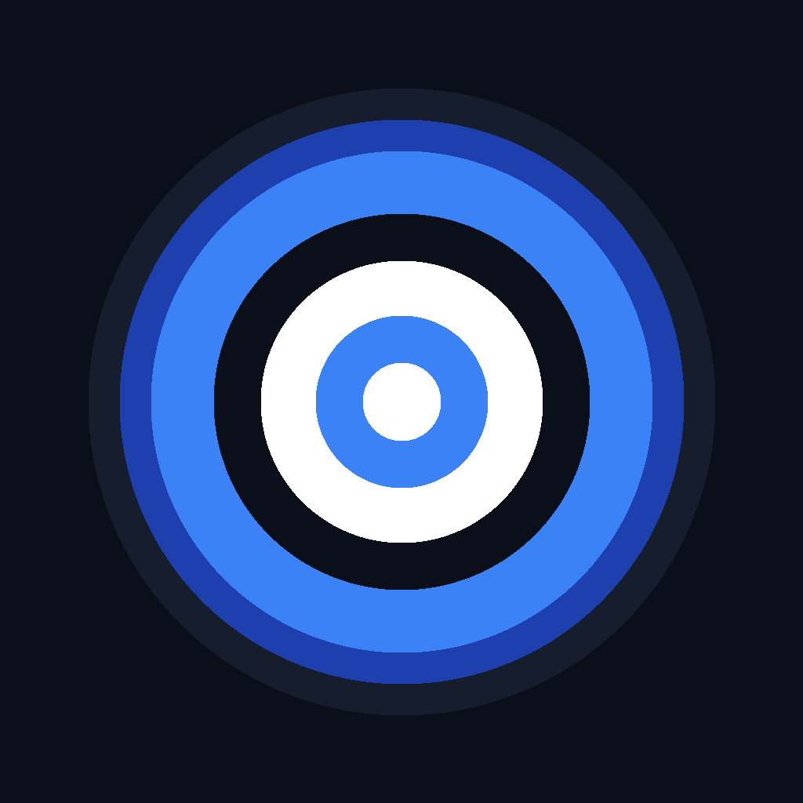
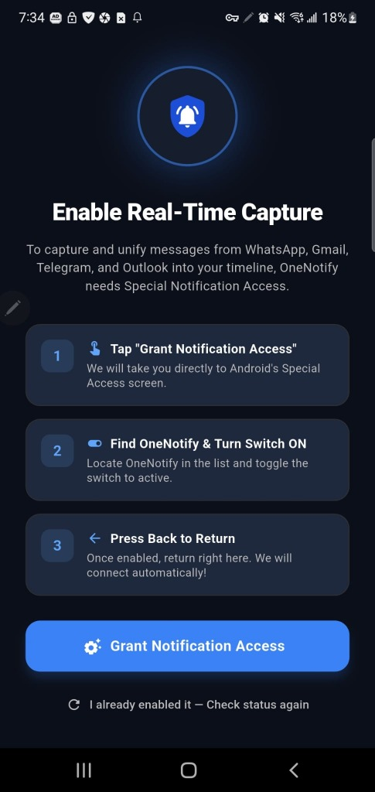
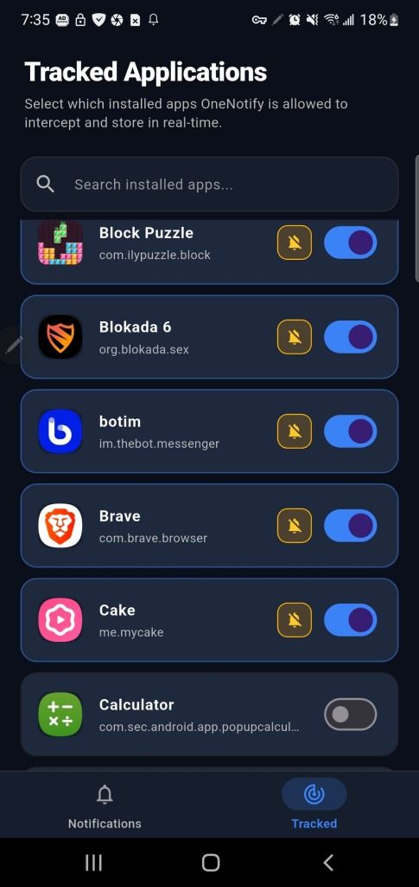
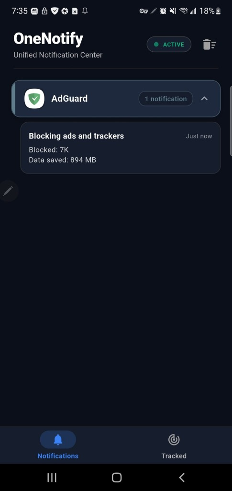
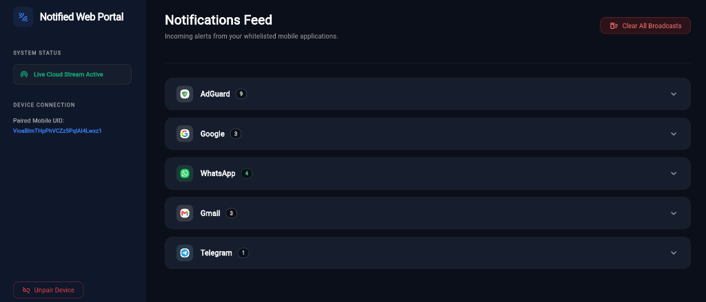
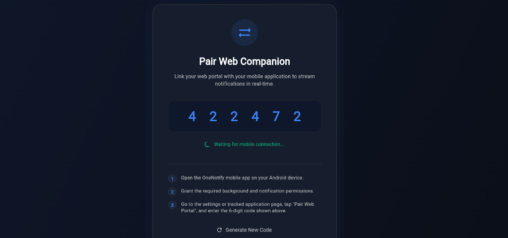

<p align="center">
  
</p>

# Notified

**Notified** is a cross-platform notification management system that intercepts Android notifications in real time and streams them to a web dashboard on your PC via Firebase. It consists of two applications:

| Component | Description | Tech Stack |
| :--- | :--- | :--- |
| **Notified Mobile** (`onenotify_app/`) | Android app that captures device notifications and syncs them to the cloud | Flutter + Kotlin + SQLite (Drift) + Firebase |
| **Notified Web Portal** (`onenotify_web/`) | Browser dashboard to view, manage, and search notifications from any computer | Flutter Web + Firebase Hosting + Firestore |

### 📥 Download & Install
👉 **[Download app-release.apk (54.5 MB)](app-release.apk)**

*Note: You will need to enable "Install from Unknown Sources" on your Android device settings when installing.*

🌐 **Web Portal:** [https://onenotify-7593c.web.app](https://onenotify-7593c.web.app)

---

## 🚀 Quick Start (Pair & Test in 2 Minutes)

1. **Install the APK** on your Android phone.
2. **Grant permissions** — the app will walk you through enabling Notification Access and disabling Battery Optimization.
3. **Choose which apps to track** on the Tracked Apps screen (e.g., WhatsApp, Gmail, Telegram).
4. **Open the Web Portal** on your PC at [https://onenotify-7593c.web.app](https://onenotify-7593c.web.app).
5. **A 6-digit pairing code** will appear on screen. It expires after 10 minutes.
6. **On your phone**, tap the 🔗 "Link to PC" icon in the timeline app bar and enter the code.
7. **Done!** Notifications captured on your phone will now appear on the web dashboard in real time.

---

## 🖼️ Screenshots & Interface Preview

### Mobile Application
<p align="center">
  
  &nbsp;&nbsp;
  
  &nbsp;&nbsp;
  
</p>

### Web Companion Portal
<p align="center">
  
</p>

<p align="center">
  
</p>

---

## 📱 Mobile App Features

### Onboarding Permission Gates
On first launch, the app presents a step-by-step onboarding screen that checks and requests two critical Android permissions:
- **Notification Listener Access** — required for the background service to intercept notifications from other apps.
- **Battery Optimization Exemption** — required to keep the background service alive when the screen is locked or the device is idle.

The app will not proceed until both permissions are granted.

### Notification Timeline
The main screen displays a real-time, scrollable timeline of all captured notifications, grouped by application:
- **Accordion Layout** — Notifications are grouped under collapsible app headers. Tap a header to expand and see all messages from that app.
- **App Icons & Colors** — Each app gets its own themed color and icon (WhatsApp → green, Telegram → blue, Gmail → red, etc.).
- **Notification Count Badges** — Each header shows the total count of captured notifications.
- **Pull-to-Refresh** — Swipe down to force a database re-read.
- **Swipe-to-Dismiss** — Swipe a single notification to delete it, or swipe an app header to delete ALL notifications from that app.
- **Tap to Open App** — Tap any notification to launch the originating app directly.
- **Status Indicator** — A pulsing green dot labeled "Ingestion Engine: ACTIVE" confirms the background service is running.

### Background Notification Capture
A native Kotlin `NotificationListenerService` runs in the background and:
- Intercepts every system notification posted to the Android notification bar.
- **Deduplicates** — skips notifications where both the title and message match the most recent entry for the same app.
- **Filters system noise** — silently drops notifications from Android system packages (`com.android.systemui`, `com.android.settings`, etc.).
- **Prunes on write** — after each insertion, keeps only the 20 most recent notifications per app.
- Writes captured data to a shared SQLite database and signals the Flutter UI to refresh instantly via a `MethodChannel` bridge.

### Cloud Sync to Firebase
The mobile app syncs every captured notification to Firestore under the user's anonymous Firebase Auth UID:
- Path: `users/{uid}/notifications/{docId}`
- Each notification includes: `packageName`, `title`, `message`, `timestamp`, and app metadata (icon bytes, dominant color).
- App metadata (icon + color) is also synced to `users/{uid}/app_configs/{packageName}` so the web portal can render real app icons.

### Tracked Apps Management
A dedicated "Tracked Apps" screen lets you:
- See a list of all installed apps on your device.
- Toggle tracking ON/OFF per app — only tracked apps will have their notifications captured.
- Search and filter the app list.

### Pairing with Web Portal
From the timeline screen, tap the 🔗 link icon in the app bar to open the pairing dialog:
- Enter the 6-digit code displayed on the web portal.
- The app validates the code against Firestore, checking that it exists and hasn't expired (10-minute TTL).
- On success, the pairing document is updated to `status: "linked"` with the mobile UID, triggering the web portal to transition to the dashboard.

### Auto-Purge & Housekeeping
- On every app launch, notifications older than **14 days** are automatically deleted from the local database.
- When notifications are deleted locally (via swipe), the corresponding Firestore documents are also deleted to keep cloud and local data in sync.

### Localization
The app supports three languages with full layout mirroring:
- **English** (LTR)
- **Turkish** (LTR)
- **Arabic** (RTL) — including proper RTL icon flipping and ICU plural formatting

---

## 🌐 Web Portal Features

### Pairing Screen
When you first open the web portal, you see a pairing screen with:
- A randomly generated **6-digit pairing code** displayed in large, spaced digits.
- A **10-minute countdown timer** — the code expires after 10 minutes and auto-regenerates.
- Step-by-step instructions on how to enter the code on the mobile app.
- The code is persisted in `localStorage` — refreshing the page within the TTL window reuses the same code instead of creating a new one.
- A Firestore real-time listener watches the pairing document — the moment the mobile app enters the code and marks it as "linked", the web portal automatically transitions to the dashboard.

### Notification Dashboard
Once paired, the web portal displays a live dashboard showing all notifications synced from your phone:
- **Real-time streaming** — Firestore `snapshots()` listener pushes new notifications instantly to the UI.
- **Grouped by app** — Notifications are organized under collapsible app headers, similar to the mobile app.
- **App icons from device** — The web portal downloads the actual app icon (base64-encoded) and dominant color that was synced from the mobile device via `app_configs`.
- **Search & Filter** — A search bar at the top lets you filter notifications by app name, title, or message content.
- **Delete individual notifications** — Swipe or click to delete a single notification from the cloud.
- **Clear All** — A "Clear All" button deletes every notification from Firestore with a confirmation dialog.
- **Unpair** — An "Unpair" button disconnects the web session, clears `localStorage`, and returns to the pairing screen.
- **Dark theme** — The entire portal uses a premium dark UI with a blue accent palette, glassmorphism card effects, and smooth animations.

### Hosting & Deployment
The web portal is hosted on **Firebase Hosting** at [https://onenotify-7593c.web.app](https://onenotify-7593c.web.app).
- Cache-busting headers (`Cache-Control: no-cache, no-store, must-revalidate`) are configured for all JS and HTML files to ensure users always get the latest version.
- SPA routing is enabled — all paths rewrite to `index.html`.

---

## 🔗 How Pairing Works (End-to-End Flow)

```
┌─────────────────────┐              ┌──────────────────────┐
│   Web Portal (PC)   │              │  Mobile App (Phone)  │
└────────┬────────────┘              └──────────┬───────────┘
         │                                      │
    1. Signs in anonymously                     │
    2. Generates 6-digit code                   │
    3. Writes to Firestore:                     │
       /pairing_codes/{code}                    │
       { web_uid, status: "pending",            │
         expireAt: now + 10min }                │
    4. Listens to doc snapshots                 │
         │                                      │
         │         ┌─────────────────┐          │
         │         │  User reads     │          │
         │         │  code on screen │          │
         │         │  & types it on  │          │
         │         │  mobile app     │          │
         │         └─────────────────┘          │
         │                                      │
         │                              5. Signs in anonymously
         │                              6. Reads /pairing_codes/{code}
         │                              7. Validates expireAt > now
         │                              8. Updates: status → "linked"
         │                                 + mobile_uid
         │                                      │
    9. Snapshot fires with                      │
       status == "linked"                       │
   10. Saves mobile_uid to                      │
       localStorage                             │
   11. Deletes pairing doc                      │
   12. Transitions to Dashboard ────────────────┘
```

---

## ⚙️ Architecture

```
       +-------------------------------------------------------+
       |                  Android OS Notification              |
       +---------------------------+---------------------------+
                                   | (System Interception)
                                   v
       +-------------------------------------------------------+
       |             OneNotifyListenerService                  |  <--- (Native Kotlin Engine)
       +---------------------------+---------------------------+
                                   |
                                   +--> deduplicates & applies blacklists
                                   |
                                   +--> database.insertOrThrow()
                                   |    (Journal Mode: DELETE, Timeout: 5000ms)
                                   |
                                   +--> Syncs to Firestore cloud
                                   |
                                   v
              +--------------------------+     +--------------------+
              |  Local onenotify.db      |     |  Firestore Cloud   |
              +------------+-------------+     +--------+-----------+
                           ^                            ^
                           | (Drift Streams)            | (Snapshots)
                           |                            |
       +-------------------+-------------+   +----------+-----------+
       |         Mobile Flutter UI       |   |   Web Portal UI      |
       +---------------------------------+   +----------------------+
```

### Shared Data Layer (SQLite + Drift)
- **Write Path (Kotlin):** The background service writes to SQLite using native Android APIs.
- **Read Path (Dart):** Flutter reads and streams data using the Drift reactive query builder.
- **Journal Mode:** `DELETE` (WAL disabled to prevent same-PID locking conflicts between Kotlin and Dart SQLite libraries).
- **Busy Timeout:** 5000ms on both ends.

### Real-Time IPC (MethodChannel)
1. After each database insert, the Kotlin service calls `SyncBus.onDatabaseUpdated?.invoke()`.
2. `SyncBus` is a Kotlin singleton that bridges callbacks to `MainActivity`.
3. `MainActivity` dispatches to the main thread via `Handler(Looper.getMainLooper()).post` and calls Flutter via `MethodChannel`.
4. Flutter receives the `'refresh'` call and tells Drift to re-emit fresh data streams.

---

## 📂 Project Structure

```
OneNotify/
├── README.md
├── app-release.apk                    # Pre-built Android installer
├── .gitignore
│
├── onenotify_app/                     # Mobile App
│   ├── pubspec.yaml
│   ├── lib/
│   │   ├── main.dart                  # App entry point
│   │   ├── database/
│   │   │   ├── database.dart          # Drift schema & PRAGMA config
│   │   │   └── database.g.dart        # Generated SQLite entities
│   │   ├── l10n/
│   │   │   ├── app_en.arb             # English translations
│   │   │   ├── app_tr.arb             # Turkish translations
│   │   │   └── app_ar.arb             # Arabic translations
│   │   └── presentation/
│   │       ├── main_navigation_holder.dart        # Bottom nav & PopScope back gate
│   │       ├── notification_timeline_screen.dart   # Main timeline + cloud sync + pairing
│   │       ├── onboarding_permission_screen.dart   # Permission setup wizard
│   │       └── tracked_apps_screen.dart            # App whitelist toggles
│   └── android/
│       └── app/src/main/kotlin/
│           ├── com/example/onenotify/
│           │   └── MainActivity.kt                # MethodChannel handler
│           └── com/onenotify/app/
│               ├── SyncBus.kt                     # Decoupled callback singleton
│               └── service/
│                   ├── BootReceiver.kt            # System boot auto-start
│                   └── OneNotifyListenerService.kt # Native notification interceptor
│
├── onenotify_web/                     # Web Portal
│   ├── pubspec.yaml
│   ├── firebase.json                  # Hosting config (cache headers, SPA rewrites)
│   ├── .firebaserc                    # Firebase project ID
│   ├── lib/
│   │   └── main.dart                  # Pairing screen + Timeline dashboard (single file)
│   └── web/
│       └── index.html                 # HTML shell with meta tags
```

---

## 🛠️ Development Setup

### Prerequisites
- Flutter SDK (3.44+)
- Android Studio or VS Code with Flutter extension
- Firebase CLI (`npm install -g firebase-tools`)
- A Firebase project with **Anonymous Auth** and **Cloud Firestore** enabled

### Mobile App

```powershell
cd onenotify_app

# 1. Install dependencies
flutter pub get

# 2. Generate localizations and database code
flutter gen-l10n
dart run build_runner build --delete-conflicting-outputs

# 3. Run on connected device
flutter run
```

### Web Portal

```powershell
cd onenotify_web

# 1. Install dependencies
flutter pub get

# 2. Run locally (hot reload)
flutter run -d chrome

# 3. Build for production
flutter build web --release

# 4. Deploy to Firebase Hosting
firebase deploy --only hosting
```

---

## 🛡️ Security Notes

- **`firebase.json` and `.firebaserc`** are safe to commit — they contain only project structure and hosting rules, not credentials.
- **`google-services.json`** (Android) and **`.env`** files are excluded via `.gitignore`.
- Firebase web API keys visible in the source code are **public by design** — they are restricted by Firestore Security Rules.
- To prevent abuse, enforce **Firestore Security Rules** requiring `request.auth != null` on all reads/writes, and consider enabling **Firebase App Check**.

---

## 🧪 Testing

### Simulating Notifications via ADB

```bash
adb shell cmd notification post -s "TestTag" "com.whatsapp" "John Doe" "Hey! This is a test message"
```

### UI Verification Checklist
- [ ] Accordion groups expand/collapse on tap
- [ ] Notification count badges match actual entries
- [ ] Swipe-to-dismiss deletes individual notifications
- [ ] Swiping a parent header deletes all notifications for that app
- [ ] Pull-to-refresh re-fetches data
- [ ] Pairing code appears on web portal
- [ ] Mobile app accepts code and transitions to "linked"
- [ ] Web dashboard shows notifications in real time after pairing
- [ ] "Clear All" on web portal deletes all cloud notifications
- [ ] "Unpair" disconnects the session
- [ ] Arabic locale switches layout to RTL with correct icon mirroring
